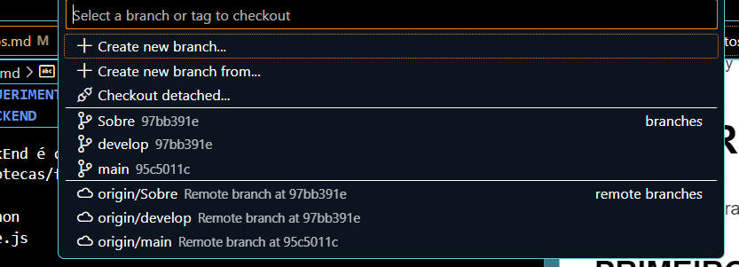
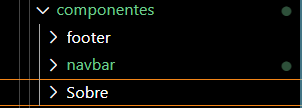

# REQUERIMENTOS ANTES DO MERGE

Antes de dar um pull request para merge, é essencial ler este arquivo para uso próprio, se atente a todas as questões necessárias.

## FRONTEND

O FrontEnd é composto atualmente pelos seguintes componentes/bibliotecas/frameworks:

* Javascript
* React
* Bootstrap
* CSS

## BACKEND

O BackEnd é composto atualmente pelos seguintes componentes/bibliotecas/frameworks:

* Python
* Node.js

## BANCO DE DADOS

Os bancos de dados utilizado atualmente são:

* SQLAlchemy

# PULL REQUEST
Para fazer sua branch e trabalhar no TCC, siga estes passos:

### PRIMEIRO: CLONAR A BRANCH DEVELOP 
No seu visual estudio(ou qualquer outra IDE de sua preferencia que de pra fazer isso), baixe a extensão do GIT ou o proprio git **(se estiver no VSCODE, recomendo o gitLens)** e clone o repositorio **"develop"**.

### SEGUNDO: AO CLONAR CRIE UMA BRANCH NOVA
Crie uma branch para a sua nova alteração com o nome da pagina/funcionalidade que você está responsável, é só apertar em create new branch e colocar o nome da sua pagina ou função
(No exemplo abaixo coloquei uma que fiz de exemplo, no caso a branch "Sobre").

### TERCEIRO: CRIE UMA PASTA DENTRO DE COMPONENTES
Após tudo isso, na pasta /TCC/src/componentes/ crie uma pasta com o nome da pagina que você está criando, exemplo, se estou fazendo a página de "Sobre", vou criar a pasta SOBRE.

<b>ATENÇÃO:</b> **Você verá duas pastas de inicio que é ***"footer" e "navbar"***, elas são componentes fixos que terão em todas as páginas(menos login provavelmente), importe elas para o seu conteudo sem mexer nos seus códigos.**

### QUARTO: SUBA SUAS PASTAS/CÓDIGOS E NÃO DE MERGE NA DEVELOP NEM NA MAIN
Só para a gente se organizar, assim que você subir seus códigos não de merge imediatamente, só suba os códigos pro git e avisa o pessoal no grupo do zap.

***

# ALGUMAS INFORMAÇÕES VISUAIS

## TELAS 
As tratativas de telas são **atualmente** apenas para:

* Desktops
* Notebooks

Sendo inicialmente a tentativa de criação de tela para monitores maiores ou seja, foco em **Desktops** com resolução de 1900x1200, e futuramente para telas menores.

## COMPONENTES FIXOS

Alguns componentes serão fixos, ou seja devem ser componentes **SEPARADOS**, para serem colocados em quase todas as páginas (exceção a tela de login).

* Footer
* Navbar

# STATUS DO DESENVOLVIMENTO

Em desenvolvimento.

## FASES DO PROJETO

No momento estamos na fase de:

- Escopo das paginas (completo);
- Documentação e Video do projeto (completo);
- Desenvolvimento do FrontEnd das paginas (em andamento);
- Desenvolvimento do BackEnd das paginas (em andamento).
 . . .

